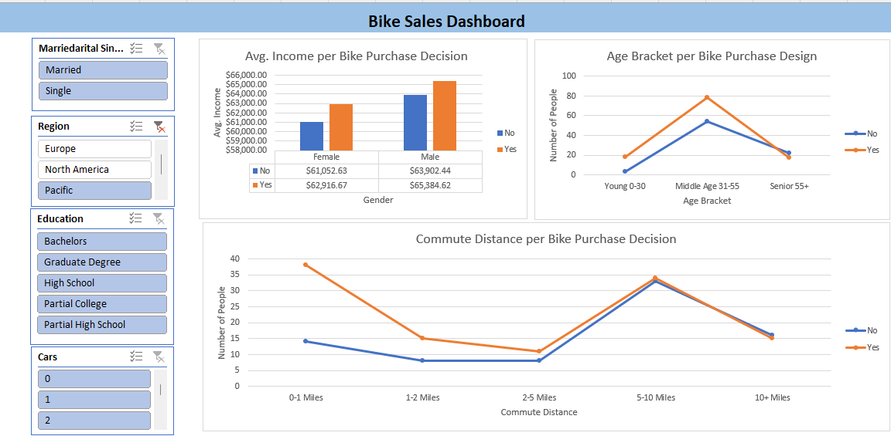

# 🚴 Bike Sales Dashboard (Microsoft Excel)

## 📌 Project Overview

Developed an interactive Microsoft Excel dashboard to analyze customer demographics, purchasing behavior, and factors influencing bike purchase decisions. The dashboard enables business users to identify customer segments, understand buying patterns, and support targeted marketing strategies through dynamic visualizations and slicers.

---

## 🎯 Business Objective

- Analyze customer purchasing behavior
- Identify demographic factors influencing bike purchases
- Compare purchasing decisions across different regions
- Understand the relationship between income and bike purchases
- Analyze the impact of age, education, commute distance, and car ownership on buying decisions
- Support business decision-making through interactive reporting

---

## 🛠 Tools Used

- Microsoft Excel
- Pivot Tables
- Pivot Charts
- Slicers
- Conditional Formatting
- Data Cleaning
- Data Analysis

---

## 📊 KPIs & Analysis

- Average Income by Bike Purchase
- Bike Purchase by Age Group
- Bike Purchase by Commute Distance
- Regional Analysis
- Education Level Analysis
- Car Ownership Analysis
- Marital Status Analysis

---

## 📈 Dashboard Features

- Interactive slicers for Region, Education, Marital Status, and Car Ownership
- Dynamic Pivot Charts
- Interactive filtering
- Comparative trend analysis
- Executive dashboard layout

---

## ❓Business Questions Answered

- Which age group purchases bikes the most?
- Does higher income influence bike purchases?
- Which region has the highest bike purchase rate?
- Does commute distance affect buying decisions?
- How does education level impact bike purchases?
- Does owning more cars reduce the likelihood of purchasing a bike?

---

## 🔍 Key Business Insights

- Middle-aged customers (31–55 years) showed the highest bike purchase rate.
- Customers with higher average incomes were more likely to purchase bikes.
- Commute distance influenced purchasing behavior.
- Customer demographics played an important role in purchase decisions.
- Interactive slicers allowed quick comparison across multiple customer segments.

---

## 💡 Business Recommendations

- Target middle-aged professionals with marketing campaigns.
- Focus on customers with higher income brackets.
- Create region-specific marketing strategies.
- Offer promotional campaigns based on commute distance.
- Use demographic segmentation for personalized customer engagement.

---

## 📷 Dashboard Preview

---

## 📥 Download Dashboard

👉 [Download Excel Dashboard](Bike_Sales_Dashboard.xlsx)

---

## ⭐ Skills Demonstrated

- Business Analysis
- Data Analysis
- Dashboard Development
- KPI Reporting
- Microsoft Excel
- Pivot Tables
- Pivot Charts
- Interactive Reporting
- Data Visualization
- Business Insights
- Decision Support Reporting

---

## 📂 Dataset

The dashboard analyzes customer demographic and purchasing data including:

- Gender
- Age
- Income
- Marital Status
- Education
- Region
- Commute Distance
- Car Ownership
- Bike Purchase Decision

---

## 👤 Author

**Prasheeta Shetty**

Business Analyst | SQL | Power BI | Excel | Tableau | Python
