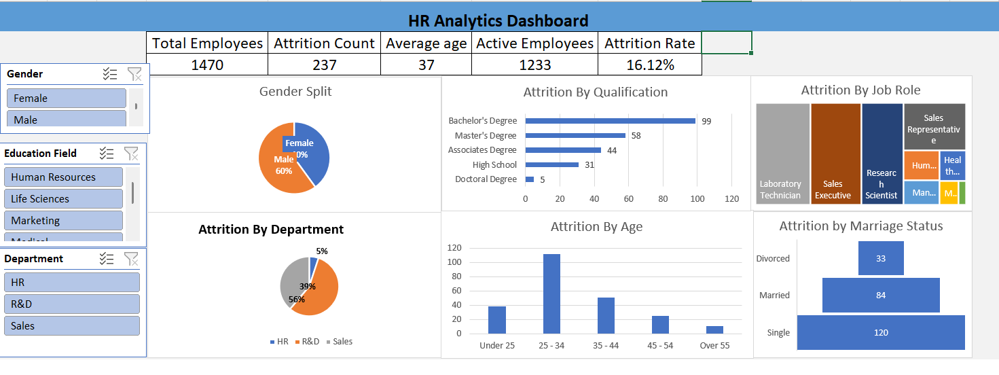

# 👥 HR Analytics Dashboard (Microsoft Excel)

## 📌 Project Overview

Developed an interactive HR Analytics dashboard in Microsoft Excel to analyze workforce metrics, employee attrition, demographic trends, and organizational performance. The dashboard provides HR teams and business leaders with actionable insights to improve employee retention and workforce planning.

---

## 🎯 Business Objective

- Monitor workforce performance and employee attrition
- Analyze employee demographics
- Identify factors contributing to attrition
- Support workforce planning and retention strategies
- Enable HR decision-making through interactive reporting

---

## 🛠 Tools Used

- Microsoft Excel
- Pivot Tables
- Pivot Charts
- Slicers
- Conditional Formatting
- Data Cleaning

---

## 📊 KPIs

- Total Employees
- Active Employees
- Attrition Count
- Attrition Rate
- Average Employee Age

---

## 📈 Dashboard Features

- Interactive slicers for:
  - Gender
  - Department
  - Education Field
- KPI Cards
- Dynamic Pivot Charts
- Interactive filtering
- HR performance reporting

---

## ❓ Business Questions Answered

- What is the current employee attrition rate?
- Which departments experience the highest attrition?
- Which job roles have the highest turnover?
- Does education level impact employee attrition?
- Which age groups are leaving the organization most frequently?
- Does marital status influence employee attrition?

---

## 🔍 Key Business Insights

- Overall attrition rate is **16.12%**.
- Employees aged **25–34** represent the largest attrition group.
- R&D and Sales departments contribute the highest employee turnover.
- Bachelor's degree holders account for the largest proportion of attrition.
- Single employees show higher attrition compared to married employees.

---

## 💡 Business Recommendations

- Strengthen retention programs for employees aged 25–34.
- Conduct department-specific attrition analysis for Sales and R&D.
- Improve employee engagement initiatives.
- Develop targeted career progression plans.
- Monitor high-risk employee groups through periodic HR reporting.

---

## 📷 Dashboard Preview

---

## 📥 Download Dashboard

👉 [Download Excel Dashboard](HR_Analytics_Dashboard.xlsx)

---

## ⭐ Skills Demonstrated

- Business Analysis
- HR Analytics
- KPI Reporting
- Dashboard Development
- Microsoft Excel
- Pivot Tables
- Pivot Charts
- Data Visualization
- Interactive Reporting
- Data Analysis
- Decision Support Reporting

---

## 📂 Dataset

The dashboard analyzes employee information including:

- Employee ID
- Department
- Job Role
- Gender
- Age
- Education
- Marital Status
- Attrition
- Employment Status

---

## 👤 Author

**Prasheeta Shetty**

Business Analyst | SQL | Power BI | Excel | Tableau | Python
