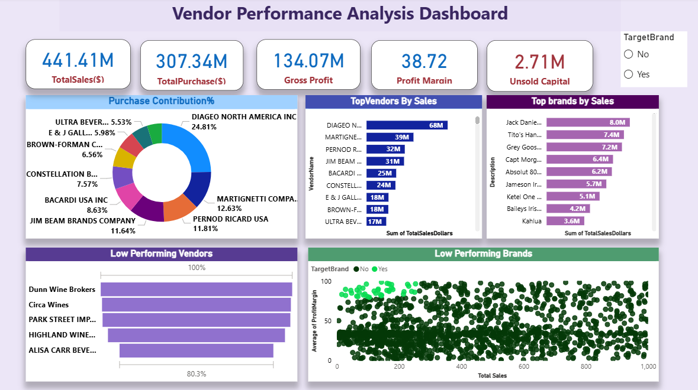
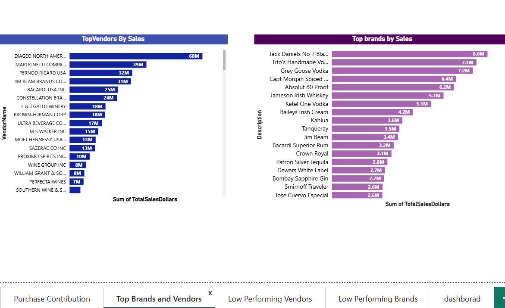
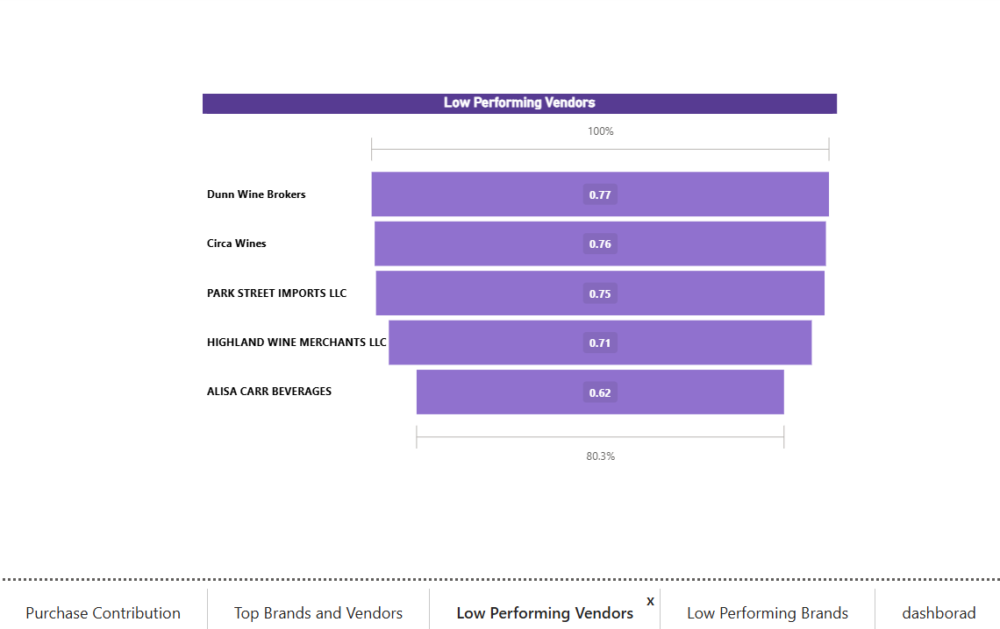
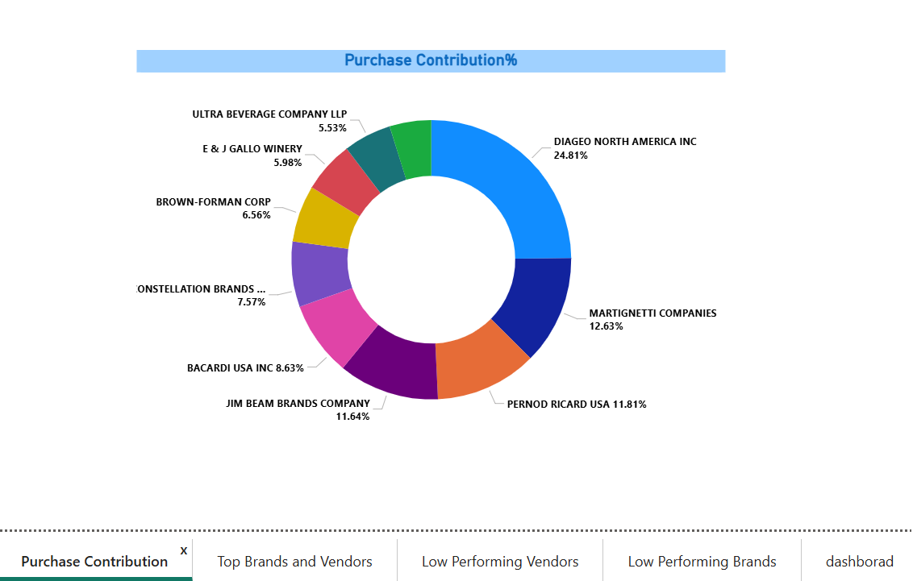
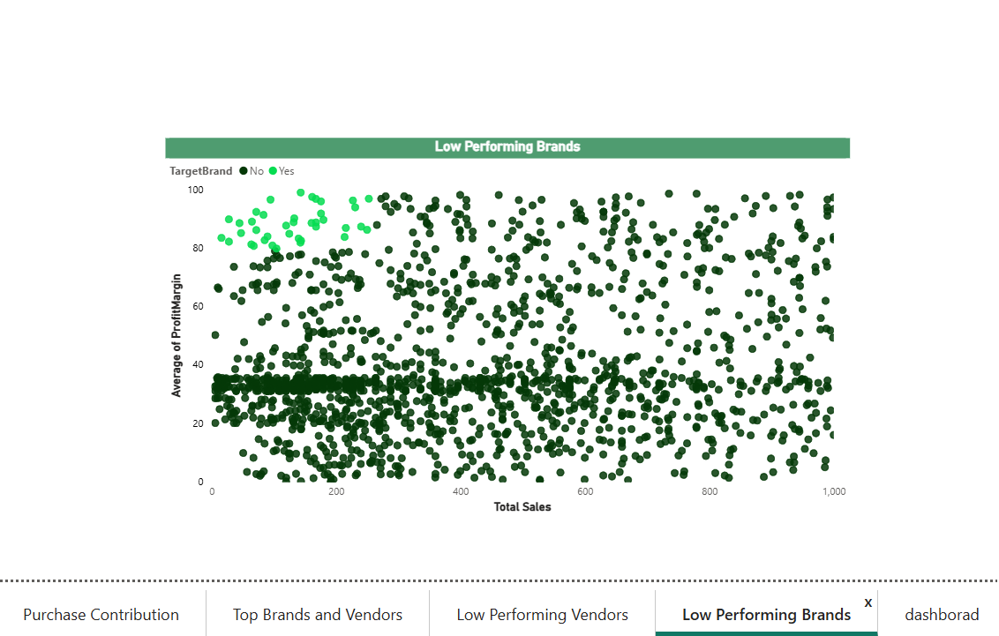

# 📊 Vendor Performance Analytics Dashboard

## 🚀 Project Highlights
✔ Built an interactive Power BI dashboard
✔ Analyzed 6+ vendor performance KPIs
✔ Identified top-performing and low-performing vendor
✔ Monitored profitability and inventory trends
✔ Enabled data-driven procurement decisions

## 📌 Project Overview
Developed an interactive Power BI dashboard to analyze vendor performance, inventory trends, profitability, and purchasing patterns. The dashboard enables business users to monitor vendor KPIs and make data-driven procurement decisions.

---

## 🎯 Business Objective

- Evaluate vendor performance
- Monitor inventory health
- Identify top and low-performing vendors
- Improve purchasing decisions
- Track profitability

---

## 🛠️ Tools Used

- Power BI
- SQL
- Excel

---

## 📈 KPIs

- Total Sales
- Gross Profit
- Profit Margin
- Vendor Contribution
- Inventory Turnover
- Purchase Cost
- Unsold Inventory

---

## 🔍 Business Insights

- Identified top-performing vendors based on sales and profitability.
- Highlighted vendors contributing to lower margins.
- Monitored inventory movement to identify slow-moving stock.
- Enabled business users to compare vendor performance across multiple dimensions.

---

## 💡 Recommendations

- Increase procurement from high-performing vendors.
- Review contracts with underperforming vendors.
- Reduce inventory holding for slow-moving products.
- Monitor profitability trends regularly.

---

## 🖼 Dashboard Preview

## 📈 Top Brands & Vendors

---

## 👥 Low performing Vendors

---

## 📦 Purchase Contribution

---

## 💰 Low performing Brands

---

## ⭐ Skills Demonstrated

- Business Analysis
- Data Visualization
- KPI Reporting
- Dashboard Development
- SQL
- Power BI
- Business Insights
- Data Analysis
- Stakeholder Reporting

- ## ⚙ Technical Implementation

Power Query,
Data Cleaning,
Data Transformation,
DAX Measures,
Data Modeling,
Relationships,
Interactive Filters,
Slicers,
Drill Through

---

## 📥 Download Power BI Dashboard

👉 [Download the Power BI Dashboard](Vendor_Performance_analysis_dashboard.pbix)

